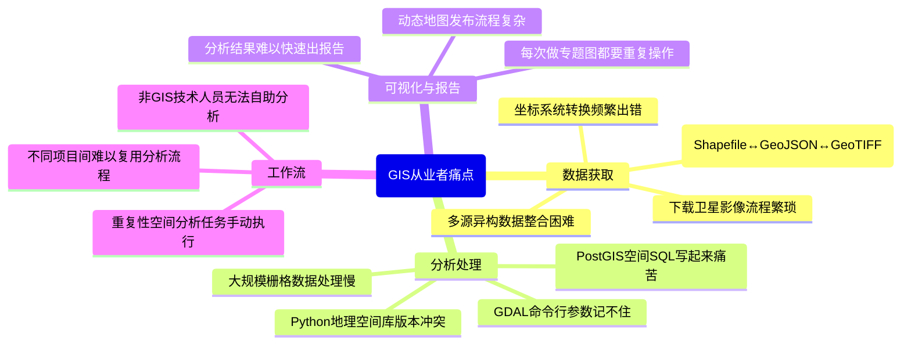
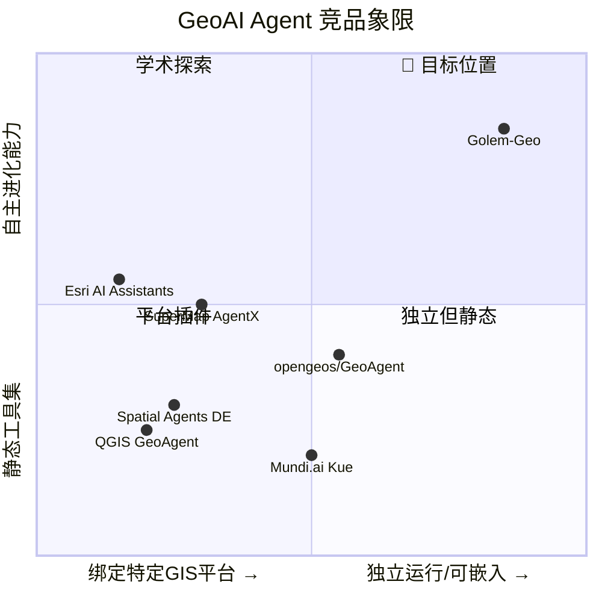

# Golem × GeoAI：时空大数据垂直领域差异化战略

> [!IMPORTANT]
> 你的直觉非常对。**垂直领域 + 自主进化**的组合，比在通用 Agent 赛道上厮杀有价值得多。GIS/时空大数据是一个 **痛点明确、工具碎片化严重、专业门槛高** 的领域，恰好是 AI Agent 最能创造价值的场景。

---

## 一、竞品全景：GeoAI Agent 赛道谁在做？

| 项目 | 形态 | 特点 | 弱点 |
|------|------|------|------|
| **opengeos/GeoAgent** | Python Jupyter 插件 | 4-Agent LangGraph管线，STAC搜索，代码透明 | 仅 Jupyter 环境，不可部署/不可嵌入 |
| **Spatial Agents (DE)** | QGIS 插件 | 连接 QGIS/GRASS/GDAL，欧盟合规 | 绑死 QGIS，不独立运行 |
| **iamtekson/GeoAgent** | QGIS 插件 | 自然语言操作 QGIS | 功能浅，无自主分析能力 |
| **boettiger-lab/geo-agent** | JavaScript Web | MapLibre + DuckDB SQL | 纯前端，无后端 Agent 能力 |
| **SuperMap AgentX** | 商业闭源 | 知识/工作流/自主三类 Agent | 闭源，绑定 SuperMap 生态 |
| **Esri AI Assistants** | ArcGIS 内置 | 深度集成 ArcGIS，实时空间AI | 极其昂贵，完全闭源 |
| **Mundi.ai (Kue)** | Web GIS | 首个AI-first开源WebGIS | 侧重地图编辑，非数据分析 |
| **GeoAI Python Package** | Python 库 | 高级 API，支持多种空间格式 | 是库不是 Agent，无自主能力 |

### 关键发现

> [!TIP]
> **没有一个竞品同时具备以下三个特征：**
> 1. 可独立运行的 Agent（不绑死 QGIS/ArcGIS/Jupyter）
> 2. 有自主进化能力（Tool Fabrication、Skill Evolution）
> 3. 面向时空大数据全链路（数据获取 → 分析 → 可视化 → 报告）

这就是 Golem 的机会窗口。

---

## 二、GIS/时空大数据领域的痛点清单

基于研究和领域分析，从业者面临的核心痛点：

### 高频刚需痛点（做了就有人用）



### 你作为从业者的独特优势

你作为地理信息和时空大数据领域的从业者，比任何通用 Agent 开发者更了解：
- **哪些GDAL命令最常用但最难记**
- **PostGIS 中哪些空间查询最经常写错**
- **什么样的数据管线是重复性最高的**
- **行业用户真正的使用场景和数据格式**

这种**领域知识 + 工程能力**的组合，是纯技术团队（如 opengeos）不具备的。

---

## 三、Golem-Geo：产品定位

### 一句话定位

> **"会自我进化的时空数据分析 Agent —— 你的私人 GIS 分析师"**

或者更技术化：

> **"The self-evolving GeoAI agent that speaks PostGIS, GDAL, and your data."**

### 定位象限



---

## 四、核心功能设计

### 层次架构

```
┌─────────────────────────────────────────────────────────────────┐
│                     Golem-Geo 架构                               │
├─────────────────────────────────────────────────────────────────┤
│                                                                  │
│  Layer 4: 自主进化层                                              │
│  ┌──────────────┐ ┌──────────────┐ ┌──────────────────────┐     │
│  │ Tool         │ │ Skill        │ │ Pipeline             │     │
│  │ Fabrication  │ │ Evolution    │ │ Learning             │     │
│  │ (自动生成    │ │ (Prompt自    │ │ (从成功案例中学习    │     │
│  │  新GIS工具)  │ │  适应优化)   │ │  最佳分析管线)       │     │
│  └──────────────┘ └──────────────┘ └──────────────────────┘     │
│                                                                  │
│  Layer 3: 领域知识层                                              │
│  ┌──────────────┐ ┌──────────────┐ ┌──────────────────────┐     │
│  │ Spatial SQL  │ │ CRS          │ │ Data Catalog         │     │
│  │ Codebook     │ │ Intelligence │ │ Connector            │     │
│  │ (PostGIS     │ │ (自动坐标    │ │ (遥感/矢量/栅格     │     │
│  │  模式库)     │ │  系识别转换) │ │  多源数据接入)       │     │
│  └──────────────┘ └──────────────┘ └──────────────────────┘     │
│                                                                  │
│  Layer 2: GIS工具层                                               │
│  ┌─────┐ ┌──────┐ ┌──────┐ ┌───────┐ ┌─────┐ ┌─────────┐     │
│  │GDAL │ │Post  │ │Geo   │ │Raster │ │Tile │ │Vector   │     │
│  │/OGR │ │GIS   │ │Pandas│ │io     │ │Gen  │ │Analysis │     │
│  └─────┘ └──────┘ └──────┘ └───────┘ └─────┘ └─────────┘     │
│                                                                  │
│  Layer 1: Golem 核心引擎 (现有)                                   │
│  ┌──────┐ ┌──────┐ ┌─────┐ ┌──────┐ ┌─────┐ ┌──────────┐     │
│  │Agent │ │Tools │ │Bus  │ │Cron  │ │Mem  │ │Channels  │     │
│  │ Loop │ │Reg   │ │     │ │      │ │     │ │(TG/...)  │     │
│  └──────┘ └──────┘ └─────┘ └──────┘ └─────┘ └──────────┘     │
│                                                                  │
└─────────────────────────────────────────────────────────────────┘
```

---

### 功能 1：内置 GIS 工具集 (Layer 2)

这些是 Golem-Geo 的"Day One"工具，开箱即用：

| 工具名 | 功能 | 用户价值 |
|--------|------|----------|
| `spatial_query` | 自然语言 → PostGIS SQL 生成与执行 | "找出北京三环内所有学校500米范围内的公交站" |
| `gdal_process` | 自然语言 → GDAL 命令编排 | "把这些 TIF 文件合并、重投影到 EPSG:4326、裁剪到上海行政边界" |
| `vector_analysis` | 矢量空间分析（缓冲区、叠加、相交...) | "计算每个居民区到最近医院的距离" |
| `raster_analysis` | 栅格分析（NDVI、坡度、水文...） | "从这幅 Landsat 影像提取植被指数" |
| `crs_transform` | 智能坐标系识别与转换 | "这个数据是什么坐标系？帮我转到 WGS84" |
| `format_convert` | 地理数据格式互转 | "把 Shapefile 转成 GeoJSON，保留属性" |
| `tile_generate` | 瓦片地图生成 | "从这个 GeoTIFF 生成 XYZ 瓦片到 z=15" |
| `data_fetch` | 多源地理数据获取 | "下载北京市的 OpenStreetMap 道路数据" |

**代码示例**（Agent自动生成的 PostGIS 查询）：

```
用户: "找出2024年上海浦东新区内，距离地铁站500米范围内的新建住宅小区数量"

Golem-Geo 内部执行:
1. [spatial_query] 识别意图 → 生成 SQL:
   SELECT COUNT(*) FROM residential_areas r
   JOIN metro_stations m ON ST_DWithin(r.geom::geography, m.geom::geography, 500)
   WHERE r.district = '浦东新区'
     AND r.built_year = 2024;

2. [data_fetch] 发现本地无数据 → 自动从 OSM 获取地铁站数据
3. 执行查询 → 返回结果 + 生成空间分布地图
```

---

### 功能 2：领域知识引擎 (Layer 3)

区别于通用 Agent 的核心竞争力：

#### 2a. Spatial SQL Codebook（空间SQL代码书）

不只是让 LLM 生成 SQL，而是维护一个**经过验证的 PostGIS 查询模式库**：

```yaml
# workspace/geo-codebook/buffer-analysis.yaml
name: buffer-analysis
description: "缓冲区分析标准模式"
patterns:
  - name: point-buffer-count
    template: |
      SELECT COUNT(*) FROM {{target_table}} t
      WHERE ST_DWithin(
        t.{{geom_col}}::geography,
        ST_SetSRID(ST_MakePoint({{lon}}, {{lat}}), 4326)::geography,
        {{distance_m}}
      );
    variables:
      target_table: { type: table, required: true }
      geom_col: { type: column, default: "geom" }
      lon: { type: float, required: true }
      lat: { type: float, required: true }
      distance_m: { type: float, required: true }
    verified: true
    success_rate: 0.97
```

Agent 优先从 Codebook 匹配已验证模式，而非让 LLM 从零生成（减少幻觉）。

#### 2b. CRS Intelligence（坐标系智能识别）

GIS 从业者的日常噩梦：坐标系问题。Golem-Geo 内置：
- 自动检测数据的坐标系（通过坐标值范围、元数据、EPSG推断）
- 智能选择目标投影（面积计算？用等面积投影。距离分析？用等距投影。）
- 对常见错误（如把 CGCS2000 当 WGS84）给出预警

#### 2c. Data Catalog Connector（数据目录连接器）

内置对中国主流地理数据源的连接：

| 数据源 | 数据类型 | 接入方式 |
|--------|----------|----------|
| OpenStreetMap | 矢量 | Overpass API |
| 天地图 | 矢量/栅格 | WMTS/WFS |
| Sentinel Hub | 遥感影像 | STAC API |
| Landsat/MODIS | 遥感影像 | USGS API |
| 本地 PostGIS | 矢量 | 直连 |
| 本地文件系统 | Shapefile/GeoJSON/TIFF | 文件扫描 |
| WMS/WFS 服务 | 矢量/栅格 | OGC标准 |

---

### 功能 3：自主进化 (Layer 4)

这是 **最独特** 的能力，所有现有 GeoAI 竞品都没有：

#### 3a. Tool Fabrication for GIS（GIS工具自生成）

```
场景：用户让 Golem 做一个它没有预置工具的任务

用户: "帮我计算这条河流的弯曲系数（Sinuosity Ratio）"

Golem-Geo:
1. 检索现有工具 → 没有 sinuosity 计算工具
2. 搜索 Codebook → 没有匹配模式
3. [Tool Fabrication] 自动生成工具:
   - 生成 Python 脚本: sinuosity_calculator.py
   - 定义输入/输出 schema
   - 在沙箱中测试
   - 注册为新工具: geo_sinuosity
4. 执行新工具 → 返回结果
5. 工具保存到 workspace/tools/ → 下次直接可用
6. 可选：发布到社区工具库
```

#### 3b. Pipeline Learning（分析管线学习）

Agent 记住成功的分析流程，形成可复用的 Pipeline：

```
用户第一次: "分析一下这个区域的用地变化"
  → Agent 执行: 数据获取 → 影像裁剪 → NDVI计算 → 变化检测 → 生成报告
  → 成功！Pipeline 被自动保存

用户第二天: "对另一个区域也做一下用地变化分析"
  → Agent 识别到相似意图
  → 复用已保存的 Pipeline，仅替换参数
  → 执行速度快 10x

用户第三天: "调整一下，这次加上建筑物提取"
  → Pipeline 被更新，新步骤被插入
  → 形成 Pipeline v2
```

#### 3c. Skill Evolution for GIS（GIS技能进化）

内置的 GIS Skills 会根据使用反馈自动优化：
- 追踪每个 Skill 的成功率
- LLM 自动修改低成功率的 Prompt 模板
- A/B Test 不同版本的分析策略

---

## 五、与现有 Golem 架构的契合度

> [!NOTE]
> 好消息：你现在的架构非常适合做这件事，改动量远比从零开始小得多。

| 现有组件 | 复用方式 | 需要的扩展 |
|----------|----------|-----------|
| **Agent Loop** | 直接复用，作为 GIS Agent 核心循环 | 增加 Pipeline 编排能力 |
| **Tools Registry** | 直接复用，注册 GIS工具 | 增加 Tool Fabrication 接口 |
| **Memory** | MEMORY.md → 存储空间分析知识 | 增加空间实体关系图谱 |
| **Diary** | 记录每日分析任务日志 | 增加 Pipeline 执行日志 |
| **Cron** | 定时数据更新 / 变化检测 | 增加空间触发器（"当某区域影像更新时触发"） |
| **Skills** | GIS Skills = 领域 Prompt 包 | 增加 Codebook 集成 |
| **Heartbeat** | 监控长时间运行的空间分析任务 | 增加数据管线健康检查 |
| **Subagent** | 并行执行多个空间分析子任务 | 增加"分幅处理"编排 |
| **Policy/Audit** | 审计敏感数据操作 | 增加空间数据访问控制 |
| **Channels** | Telegram/Slack 接收分析结果 | 增加地图截图/GeoJSON 附件发送 |

---

## 六、Golem vs Golem-Geo：品牌策略

有两种路径：

### 选项 A：Golem 直接转型为 Golem-Geo

- **优点**: 聚焦，品牌清晰
- **缺点**: 放弃通用 Agent 市场
- **适合**: 如果你决定 all-in 地理信息领域

### 选项 B：Golem 作为引擎，Golem-Geo 作为垂直产品（推荐 ✅）

```
golem/                    ← 通用 Agent 引擎 (核心)
golem-geo/                ← GIS 垂直产品 (基于 golem 引擎)
  ├── tools/              ← GIS 工具集
  ├── skills/             ← GIS Prompt 包
  ├── codebook/           ← 空间 SQL 模式库
  └── pipelines/          ← 预置分析管线
```

- **优点**: 两个市场都不放弃；Golem 引擎可以被其他垂直领域（如 DevOps Agent、安全审计 Agent）复用
- **缺点**: 工作量稍大
- **适合**: 长期发展，建立生态

---

## 七、分阶段行动计划

### Phase 1（3-4 周）—— 最小可行 GIS Agent

> 目标：**让人看到 Demo 就想 Star**

1. **新增 4 个核心 GIS 工具**
   - `spatial_query`: PostGIS 自然语言查询（连接本地 PostGIS）
   - `gdal_process`: GDAL 命令编排（调用本地 gdal 命令行）
   - `crs_transform`: 坐标系智能转换
   - `format_convert`: 地理数据格式互转

> 实现注记：仓库内的实际工具命名统一采用 `geo_*` 风格，对应为 `geo_spatial_query`、`geo_process`、`geo_crs_detect`、`geo_format_convert`，并保留 `geo_info` 作为检查辅助工具。`crs_transform` 能力由 `geo_crs_detect` + `geo_process` 组合提供，而不是单独新增一个工具。

2. **创建 3 个 GIS Skills**
   - `spatial-analysis`: 通用空间分析 Prompt 包
   - `remote-sensing`: 遥感影像处理 Prompt 包
   - `data-pipeline`: 数据 ETL 管线 Prompt 包

3. **录制 Demo 视频**
   - "用自然语言完成一次完整的空间分析"
   - 场景："用自然语言分析北京市绿地覆盖率"

### Phase 2（4-6 周）—— Tool Fabrication + Codebook

4. **实现 Tool Fabrication v1**
   - Agent 可以运行时生成 Python 脚本作为新 GIS 工具
   - 新工具自动注册，下次启动自动加载

5. **实现 Spatial SQL Codebook**
   - 预置 30+ 经过验证的 PostGIS 查询模式
   - Agent 优先从 Codebook 匹配，而非让 LLM 从零生成

6. **数据目录连接器 v1**
   - 连接 OSM Overpass API
   - 连接 Sentinel STAC API
   - 本地文件系统扫描

### Phase 3（6-8 周）—— Pipeline + 社区

7. **Pipeline Learning（分析管线学习）**
   - 自动保存成功的分析流程
   - 支持参数化复用

8. **社区工具库**
   - 用户可以分享自动生成的 GIS 工具
   - GitHub-based 工具市场

9. **出论文/技术博客**
   - 在 GIScience / ACM SIGSPATIAL 社区建立影响力
   - 技术博客："How Golem-Geo auto-generates GIS tools"

---

## 八、Demo场景设计（用来吸引Star的）

````carousel
### Demo 1: "一句话空间分析"
```
$ golem chat "分析北京五环内，距离地铁站300米
  范围内的共享单车停放点密度分布"

🔧 spatial_query → 生成 PostGIS 查询
🔧 gdal_process → 生成核密度估计栅格
📊 生成分析报告 + 热力图
📤 自动发送结果到 Telegram
```
<!-- slide -->
### Demo 2: "自动监控变化"
```
$ golem cron add -n "land-change" \
    -m "检查上海浦东新区最近一周的 Sentinel-2 
    影像，如果有新建建筑物变化，生成报告" \
    --cron "0 8 * * 1"

✅ 每周一早8点自动执行
🛰️ 自动获取 Sentinel-2 影像
🔄 变化检测 → 报告生成 → Telegram 通知
```
<!-- slide -->
### Demo 3: "Tool Fabrication"
```
$ golem chat "计算这条河流的分形维数"

❓ 没有现成工具...
🔧 [Tool Fabrication] 自动生成 
   fractal_dimension.py
✅ 工具注册为 geo_fractal_dimension
📊 河流分形维数 = 1.23
💾 工具已保存，下次直接使用
```
<!-- slide -->
### Demo 4: "非GIS人员也能用"
```
# 城市规划师（非技术人员）在 Telegram 中:

👤 "帮我看看朝阳区有多少块空地适合建公园，
    面积要大于2000平米，离居民区300米以内"

🤖 正在分析...
   → 获取朝阳区用地数据
   → 空间查询空闲地块
   → 缓冲区分析居民区距离
   → 找到 47 块符合条件的地块
   
📎 [报告.pdf] [地块分布图.png] [数据.geojson]
```
````

---

## 九、为什么这个组合能赢

| 维度 | 现有竞品的状态 | Golem-Geo 的差异 |
|------|---------------|-----------------|
| **运行形态** | 绑死 QGIS/Jupyter/ArcGIS | 独立运行、可嵌入、多通道 |
| **进化能力** | 全部是静态工具集 | 自动生成工具、学习分析管线 |
| **部署成本** | Python 环境复杂 | 单二进制 + Docker，零依赖 |
| **数据接入** | 需要手动获取 | 内置多源数据目录连接器 |
| **专业性** | 学术prototype | 内置经验证的 Codebook |
| **可用性** | 需要会写代码 | 自然语言 + 多通道（Telegram等） |
| **社区传播力** | "又一个GIS AI" | "会自己写GIS工具的AI" |

> [!CAUTION]
> **最大风险**：不要掉进"做一个 ArcGIS 竞品"的陷阱。Golem-Geo 不是 GIS 平台，它是 **GIS 分析师的智能助手**。它调用 GDAL/PostGIS，而不是替代它们。就像 Claude Code 不是 IDE，而是开发者的 Agent。
